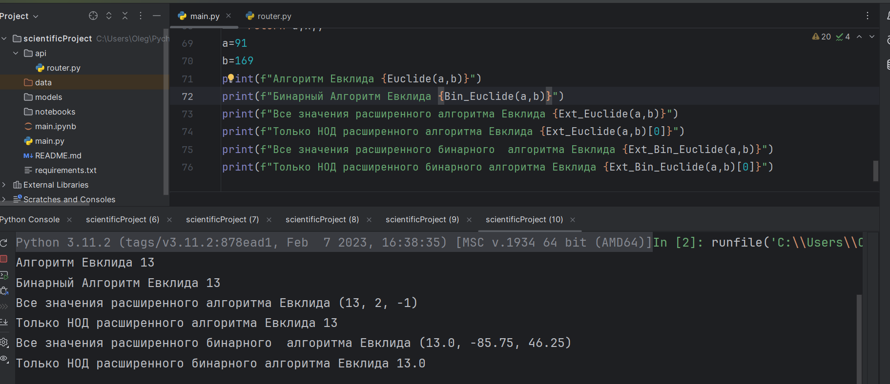

---
## Front matter
lang: ru-RU
title: Алгоритм Евклида
author: Гаглоев Олег Мелорович
institute: Российский Университет Дружбы Народов
date: 26 10, 2024, Москва, Россия

## Formatting
mainfont: PT Serif
romanfont: PT Serif
sansfont: PT Sans
monofont: PT Mono
toc: false
slide_level: 2
theme: metropolis
header-includes: 
 - \metroset{progressbar=frametitle,sectionpage=progressbar,numbering=fraction}
 - '\makeatletter'
 - '\beamer@ignorenonframefalse'
 - '\makeatother'
aspectratio: 43
section-titles: true

---

# Цели и задачи

## Цель лабораторной работы

Изучение алгоритма Евклида нахождения НОД и его вариаций.

# Выполнение лабораторной работы

## Наибольший общий делитель

Наибольший общий делитель (НОД) – это число, которое делит без остатка два числа и делится само без остатка на любой другой делитель данных двух чисел. Проще говоря, это самое большое число, на которое можно без остатка разделить два числа, для которых ищется НОД.

## Алгоритм Евклида

def Euclide(a,b):
    while a!=0 and b!=0:
        if a>=b:
            a=a%b
        else:
            b=b%a
    return a or b

## Бинарный Алгоритм Евклида
def Bin_Euclide(a,b):
    g=1
    while a%2==0 and b%2==0:
        a/=2
        b/=2
        g*=2
    u,v=a,b
    while u!=0:
        if u%2==0:
            u/=2
        if v%2==0:
            v/=2
        if u>=v:
            u-=v
        else:
            v-=u
    d=g*v
    return int(d)

## Расширенный  Алгоритм Евклида
def Ext_Euclide(a,b):
    if a==0:
        return b,0,1
    else:
        r,x,y=Ext_Euclide(b%a,a)
    return r,y-(b//a)*x,x

## Пример работы алгоритма

{ #fig:001 }

# Выводы

## Результаты выполнения лабораторной работы

Изучили алгоритм Евклида нахождения НОД.