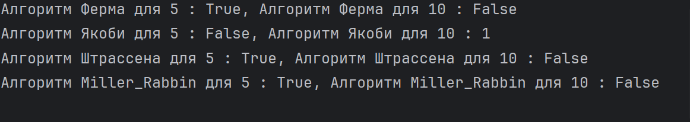

---
# Front matter
title: "Отчёт по лабораторной работе №5"
subtitle: "Вероятностные алгоритмы проверки чисел на простоту"
author: "Гаглоев Олег Мелорович"

# Generic otions
lang: ru-RU
toc-title: "Содержание"

# Bibliography
bibliography: bib/cite.bib
csl: pandoc/csl/gost-r-7-0-5-2008-numeric.csl

# Pdf output format
toc: true # Table of contents
toc_depth: 2
lof: true # List of figures
fontsize: 12pt
linestretch: 1.5
papersize: a4
documentclass: scrreprt
## I18n
polyglossia-lang:
  name: russian
  options:
	- spelling=modern
	- babelshorthands=true
polyglossia-otherlangs:
  name: english
### Fonts
mainfont: PT Serif
romanfont: PT Serif
sansfont: PT Sans
monofont: PT Mono
mainfontoptions: Ligatures=TeX
romanfontoptions: Ligatures=TeX
sansfontoptions: Ligatures=TeX,Scale=MatchLowercase
monofontoptions: Scale=MatchLowercase,Scale=0.9
## Biblatex
biblatex: true
biblio-style: "gost-numeric"
biblatexoptions:
  - parentracker=true
  - backend=biber
  - hyperref=auto
  - language=auto
  - autolang=other*
  - citestyle=gost-numeric
## Misc options
indent: true
header-includes:
  - \linepenalty=10 # the penalty added to the badness of each line within a paragraph (no associated penalty node) Increasing the value makes tex try to have fewer lines in the paragraph.
  - \interlinepenalty=0 # value of the penalty (node) added after each line of a paragraph.
  - \hyphenpenalty=50 # the penalty for line breaking at an automatically inserted hyphen
  - \exhyphenpenalty=50 # the penalty for line breaking at an explicit hyphen
  - \binoppenalty=700 # the penalty for breaking a line at a binary operator
  - \relpenalty=500 # the penalty for breaking a line at a relation
  - \clubpenalty=150 # extra penalty for breaking after first line of a paragraph
  - \widowpenalty=150 # extra penalty for breaking before last line of a paragraph
  - \displaywidowpenalty=50 # extra penalty for breaking before last line before a display math
  - \brokenpenalty=100 # extra penalty for page breaking after a hyphenated line
  - \predisplaypenalty=10000 # penalty for breaking before a display
  - \postdisplaypenalty=0 # penalty for breaking after a display
  - \floatingpenalty = 20000 # penalty for splitting an insertion (can only be split footnote in standard LaTeX)
  - \raggedbottom # or \flushbottom
  - \usepackage{float} # keep figures where there are in the text
  - \floatplacement{figure}{H} # keep figures where there are in the text
---

# Цель работы

Изучение алгоритмов Ферма, Соловэя-Штрассена, Миллера-Рабина.

# Теоретические сведения

Для построения многих систем защиты информации требуются простые числа большой разрядности. В связи с этим актуальной является задача тестирования на простоту натуральных чисел.

Существует два типа критериев простоты: детерминированные и вероятностные. Детерминированные тесты позволяют доказать, что тестируемое число - простое. Практически применимые детерминированные тесты способны дать положительный ответ не для каждого простого числа, поскольку используют лишь достаточные условия простоты.
Детерминированные тесты более полезны, когда необходимо построить большое простое число, а не проверить простоту, скажем, некоторого единственного числа.
В отличие от детерминированных, вероятностные тесты можно эффективно использовать для тестирования отдельных чисел, однако их результаты, с некоторой вероятностью, могут быть неверными. К счастью, ценой количества повторений теста с модифицированными исходными данными вероятность ошибки можно сделать как угодно малой.
На сегодня известно достаточно много алгоритмов проверки чисел на простоту. Несмотря на то, что большинство из таких алгоритмов имеет субэкспоненциальную оценку сложности, на практике они показывают вполне приемлемую скорость работы.
На практике рассмотренные алгоритмы чаще всего по отдельности не применяются. Для проверки числа на простоту используют либо их комбинации, либо детерминированные тесты на простоту.
Детерминированный алгоритм всегда действует по одной и той же схеме и гарантированно решает поставленную задачу. Вероятностный алгоритм использует генератор случайных чисел и дает не гарантированно точный ответ. Вероятностные алгоритмы в общем случае не менее эффективны, чем детерминированные (если используемый генератор случайных чисел всегда дает набор одних и тех же чисел, возможно, зависящих от входных данных, то вероятностный алгоритм становится детерминированным).

## Тест Ферма

* Вход. Нечетное целое число $n \geq 5$.
* Выход. «Число n, вероятно, простое» или «Число n составное».

1. Выбрать случайное целое число $a, 2 \leq a \leq n-2$.
2. Вычислить $r=a^{n-1} (mod n)$
3. При $r=1$ результат: «Число n, вероятно, простое». В противном случае результат: «Число n составное».

## Тест Соловэя-Штрассена

* Вход. Нечетное целое число $n \geq 5$.
* Выход. «Число n, вероятно, простое» или «Число n составное».

1. Выбрать случайное целое число $a, 2 \leq a \leq n-2$.
2. Вычислить $r=a^{(\frac{n-1}{2})} (mod n)$
3. При $r \neq 1$ и $r \neq n-1$ результат: «Число n составное».
4. Вычислить символ Якоби $s = (\frac{a}{n})$
5. При $r=s (mod n)$ результат: «Число n, вероятно, простое». В противном случае результат: «Число n составное».

## Тест Миллера-Рабина.

* Вход. Нечетное целое число $n \geq 5$.
* Выход. «Число n, вероятно, простое» или «Число n составное».

1. Представить $n-1$ в виде $n-1 = 2^sr$, где r - нечетное число
2. Выбрать случайное целое число $a, 2 \leq a \leq n-2$.
3. Вычислить $y=a^r (mod n)$
4. При $y \neq 1$ и $y \neq n-1$ выполнить действия
	- Положить $j=1$
	- Если $j \leq s-1$ и $y \neq n-1$ то
		* Положить $y=y^2 (mod n)$
		* При $y=1$   результат: «Число n составное».
		* Положить $j=j+1$
	- При $y \neq n-1$ результат: «Число n составное».
5. Результат: «Число n, вероятно, простое».

# Выполнение работы

## Реализация алгоритмов на языке Python

```
def Ferma(n):
    a=random.randint(2,n-1)
    r=(a**(n-1)%n !=1)
    if r:
        return False
    return True

def Jacobi(n):
    a=random.randint(0,n)
    if a==0:
        return 0
    if a==1:
        return 1
    g=1
    if a<0:
        a*=-1
        if(n%4==3):
            g*=-1
    while (a):
        if(a<0):
            a=-a
            if (n % 4 == 3):
                g *= -1
        while(a%2==0):
            a//=2
            if(n%8==3 or n%8==5):
                g=-g
        a,n=n,a
        if (a%4==3 and n%4==3):
            g=-g
        a=a%n
        if a>n//2:
            a=a-n
    if n==1:
        return g
    return not g

def Shtrass(n):
    a=random.randint(2,n-1)
    a=a**((n-1))
    a=a**1/2
    r=a%n
    if r!=1 or r!=n-1:
        return True
    s=Jacobi(a/n)
    if r%n==s:
        return True
    return False

def Miller_Rabbin(n):
    a=random.randint(2,n-1)
    for i in range(a,n//2):
        if n%i==0:
            return False
    return True

print(f"Алгоритм Ферма для 5 : {Ferma(5)}, Алгоритм Ферма для 10 : {Ferma(10)}")
print(f"Алгоритм Якоби для 5 : {Jacobi(5)}, Алгоритм Якоби для 10 : {Jacobi(10)}")
print(f"Алгоритм Штрассена для 5 : {Shtrass(5)}, Алгоритм Штрассена для 10 : {Shtrass(10)}")
print(f"Алгоритм Miller_Rabbin для 5 : {Miller_Rabbin(5)}, Алгоритм Miller_Rabbin для 10 : {Miller_Rabbin(10)}")
```

## Контрольный пример



# Выводы

Изучили алгоритмы Ферма, Соловэя-Штрассена, Миллера-Рабина.

# Список литературы{.unnumbered}

1. [ Алгоритмы тестирования на простоту и факторизации](https://intuit.ru/studies/courses/13837/1234/lecture/31191)
2. [Алгоритм проверки на простоту](https://habr.com/ru/post/205318/)