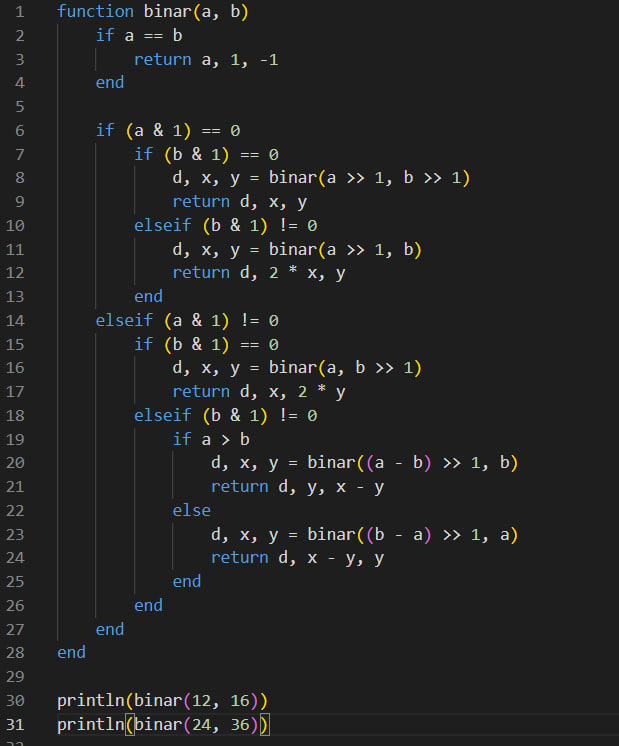

---
## Front matter
lang: ru-RU
title: Вычисление наибольшего общего делителя
subtitle: Лабораторная работа №3
author:
  - Данилова А.С.

## i18n babel
babel-lang: russian
babel-otherlangs: english

## Formatting pdf
toc: false
toc-title: Содержание
slide_level: 2
aspectratio: 169
section-titles: true
theme: metropolis
header-includes:
 - \metroset{progressbar=frametitle,sectionpage=progressbar,numbering=fraction}
---

## Цели и задачи

Изучить различные вариации алгоритма Евклида и реализовать их программно на языке Julia.

## Теоретическая часть

**Наибольший общий делитель**

**НОД** – это наибольшее натуральное целое число, на которое эти числа делятся без остатка.

## Теоретическая часть

*Алгоритм Евклида*
Нужно заменить большее из чисел на остаток от деления его на меньшее и для полученной пары повторять эту процедуру, пока одно из чисел не станет равно нулю. Тогда второе число будет равно наибольшему общему делителю исходных чисел. 

*Бинарный Алгоритм Евклида*
Данный алгоритм «быстрее» обычного алгоритма Евклида, так как вместо медленных операций деления и умножения используются сдвиги.

## Теоретическая часть

*Расширенный Алгоритм Евклида*
Расширенный алгоритм возвращает не только НОД(a, b), но и коэффициенты x и y, такие что НОД = ax + by.

*Расширенный бинарный Алгоритм Евклида*
Алгоритм находит наибольший делитель и его линейное представление. 

## Выполнение работы

{#fig:001 width=50%}

## Выполнение работы

{#fig:001 width=50%}

## Выполнение работы

{#fig:001 width=50%}

## Выполнение работы

{#fig:001 width=40%}

## Полученный результат

{#fig:001 width=75%}

## Полученный результат

{#fig:001 width=75%}

## Выводы

Мы изучили различные вариации алгоритма Евклида и реализовать их программно на языке Julia.
