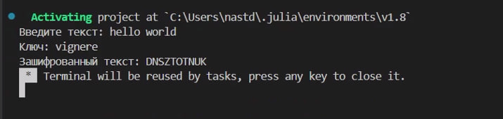

---
## Front matter
lang: ru-RU
title: Шифры перестановки
subtitle: Лабораторная работа №2
author:
  - Данилова А.С.

## i18n babel
babel-lang: russian
babel-otherlangs: english

## Formatting pdf
toc: false
toc-title: Содержание
slide_level: 2
aspectratio: 169
section-titles: true
theme: metropolis
header-includes:
 - \metroset{progressbar=frametitle,sectionpage=progressbar,numbering=fraction}
---

## Цели и задачи

Изучить и реализовать шифры перестановки: маршрутное шифрование, шифрование с помощью решеток, таблица Виженера

## Теоретическая часть

*Маршрутное шифрование*

1. Открытый текст последовательно разбивается на части (блоки) с длиной, равной произведению m и n.
2. Блок вписывается построчно в таблицу размерности m × n.
Криптограмма получается выписыванием букв из таблицы в соответствии с некоторым маршрутом. Этот маршрут вместе с числами m и n составляет ключ шифра.

## Теоретическая часть

## Теоретическая часть

Шифрование с помощью *таблицы Виженера* основано на том, что каждая буква в исходном шифруемом тексте сдвигается по алфавиту не на фиксированное, а на переменное количество символов. Величина сдвига каждой буквы задаётся ключом. 

Для шифрования используется так называемый «квадрат Виженера» — таблица, где в каждой строке алфавит сдвигается на одну позицию вправо.

## Выполнение работы

{#fig:001 width=50%}

## Полученный результат

## Выполнение работы

{#fig:002 width=50%}

## Полученный результат

## Выполнение работы

{#fig:002 width=50%}

## Полученный результат

## Выводы

Мы изучили 3 шифра перестановки и реализовали их на языке программирования Julia.
