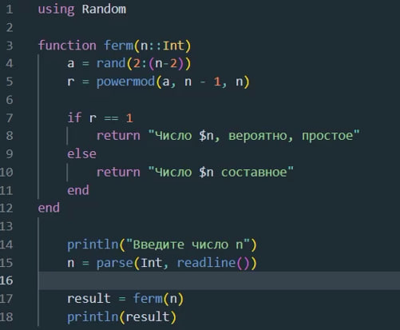
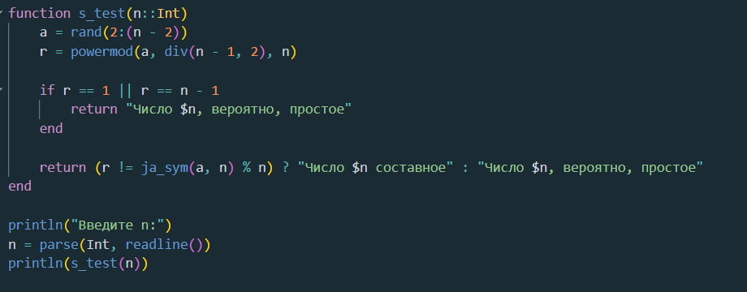

---
## Front matter
lang: ru-RU
title: Вероятностные алгоритмы проверки чисел на простоту
subtitle: Лабораторная работа №5
author:
  - Данилова А.С.

## i18n babel
babel-lang: russian
babel-otherlangs: english

## Formatting pdf
toc: false
toc-title: Содержание
slide_level: 2
aspectratio: 169
section-titles: true
theme: metropolis
header-includes:
 - \metroset{progressbar=frametitle,sectionpage=progressbar,numbering=fraction}
---

## Цели и задачи

Изучить вероятностные алгоритмы проверки чисел на простоту и реализовать их программно на языке Julia.

## Тест Ферма

При проверке числа на простоту тестом Ферма выбирают несколько чисел a. Чем больше количество a, для которых утверждение истинно, тем больше вероятность, что число n простое.

## Символ Якоби

Символ Якоби обобщает символ Лежандра на все нечётные числа, большие единицы. Символ Кронекера-Якоби, в свою очередь, обобщает символ Якоби на все целые числа, но в практических задачах символ Якоби играет гораздо более важную роль, чем символ Кронекера-Якоби.

## Тест Соловея-Штрассена

Тест всегда корректно определяет, что простое число является простым, но для составных чисел с некоторой вероятностью он может дать неверный ответ. Основное преимущество теста заключается в том, что он, в отличие от теста Ферма, распознает числа Кармайкла как составные.

## Тест Миллера-Рабина

Тест Миллера-Рабина — вероятностный полиномиальный тест простоты. Тест Миллера-Рабина позволяет эффективно определять, является ли данное число составным. Однако, с его помощью нельзя строго доказать простоту числа. Тем не менее тест Миллера-Рабина часто используется в криптографии для получения больших случайных простых чисел.

## Выполнение работы

{#fig:001 width=50%}

## Выполнение работы

{#fig:001 width=35%}

## Полученный результат

{#fig:001 width=75%}

## Выполнение работы

{#fig:001 width=50%}

## Выполнение работы

{#fig:001 width=40%}

## Полученный результат

{#fig:001 width=75%}

## Выводы

Мы изучили вероятностные алгоритмы проверки чисел на простоту и реализовали их программно на языке Julia.
